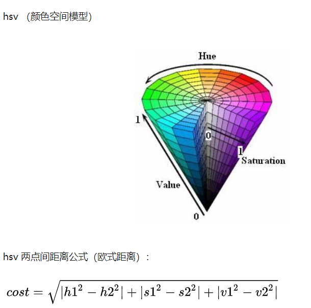

# Assignment 1

>  Details about this assignment can be found [on the course webpage](http://cs231n.github.io/), under Assignment #1 of Spring 2017.

[TOC]

## KNN

- 计算**每个**train样本与**每个**test样本的距离，得到一个dist矩阵

- 距离使用L2

- 一些技巧：

  - 若$dist$为$N * D$的，则$dist[i:0]$为$1*D$的，即dist的第$i$行

  - 计算L2善用完全平方公式

  - `numpy`中多用shape和reshape已确定好矩阵的大小

  - argsort函数

    - argsort函数返回的是数组值从小到大的索引值，配合`[:k]`可选取前k大的数据

  - bincount函数

    - 统计词频，返回的列表中`list[i]`的值表示`i`出现的次数

  - argmax函数

    - 返回最大值的索引值

  - 消除维度为1的维，除了用squeeze外，还可用`list`中的`[:,0]`

    ```python
    a = np.array([[1,2,3],[4,5,6]])
    print(a.shape) # (2,3)
    a = a.reshape(-1,1)
    print(a.shape) # (6,1)
    a = a[:,0]
    print(a.shape) # (6,)
    ```

  - `plt`画散点图

    ```python
    for k in k_choices:
        accuracies = k_to_accuracies[k]
        plt.scatter([k] * len(accuracies), accuracies)
        # plt.scatter中传入列表，可以绘制多个点，在重复实验中绘图很有用
    
    # 绘制平均线和error bar（即误差条）
    accuracies_mean = np.array([np.mean(v) for k,v in sorted(k_to_accuracies.items())])
    accuracies_std = np.array([np.std(v) for k,v in sorted(k_to_accuracies.items())])
    plt.errorbar(k_choices, accuracies_mean, yerr=accuracies_std)
    ```

    

## SVM

- 涉及图像计算，首先归一化，同时注意保存mean_image的值

- 为了不计算`bias`只计算`weight`，在所有数据集后面加一列`1`

- `loss`公式：$L_i=sum_{j\neq y_i}[max(0,w^T_jx_i-w^T_{y_i}x_i+1)]$

  - 这里 `1`表示$\Delta$	
  - 使`max(0,-)`保证了零阈值
  - **矩阵导数的求法：**参考https://zhuanlan.zhihu.com/p/24709748

  - 
    - 应当注意R(W)一项，这里使用L2正则化（但这里reg设置的也太大了吧0.0）

- `plt`画图

  ```python
  marker_size = 100 # 圆点的大小尺寸
  colors = [results[x][0] for x in results] # 这里colors即要画的点的值，即不同状态下的acc值
  #results值：
  #{(1e-07, 25000.0): (7.796751353602664e-06, 0.394),
  #(1e-07, 50000.0): (7.565597667638484e-06, 0.368),
  #(5e-05, 25000.0): (3.3177842565597667e-06, 0.154),
  #(5e-05, 50000.0): (1.0399833402748854e-06, 0.054)}
  x_scatter = [math.log10(x[0]) for x in results]
  y_scatter = [math.log10(x[1]) for x in results]
  # 这是横纵坐标值，是不同状态下lr和reg的值
  #x_scatter:[-7.0, -7.0, -4.301029995663981, -4.301029995663981]
  plt.subplot(2, 1, 1)
  plt.scatter(x_scatter, y_scatter, marker_size, c=colors) # 传入的值colors应该是各点对应的，可以传入一个序列，colors[i]对应(x_scatter[i],y_scatter[i])点处的颜色
  plt.colorbar()
  plt.xlabel('log learning rate')
  plt.ylabel('log regularization strength')
  plt.title('CIFAR-10 training accuracy')
  plt.show()
  # plot validation accuracy
  colors = [results[x][1] for x in results] # default size of markers is 20
  plt.subplot(2, 1, 2)
  plt.scatter(x_scatter, y_scatter, marker_size, c=colors)
  plt.xlabel('log learning rate')
  plt.ylabel('log regularization strength')
  plt.title('CIFAR-10 validation accuracy')
  plt.show()
  ```


## Softmax

- `IPython`在调用类方法时自动更新：

  ```python
  # for auto-reloading extenrnal modules
  # see http://stackoverflow.com/questions/1907993/autoreload-of-modules-in-ipython
  %load_ext autoreload
  %autoreload 2
  ```

- `np.linalg.norm(x, ord=None, axis=None, keepdims=False)`可用来求取**范数**
  - **ord：**默认为二范数，可取**2，1，np.inf**（无穷范数即为$max(|x_i|)​$）
  - **axis：**为列或行
  - **keepdims：**是否保持矩阵的二维特性

- 涉及log计算时可以将部分运算转化为加法或减法，防止溢出

  

## Two_layer_net

- 交叉熵在计算**exp**时，可以使用`f -= np.max(f)`来防止溢出

- **grad**的计算涉及到矩阵求导，求导要比前面的简单

  - 在求导过程中注意矩阵的大小即可，**W**和**dW**的大小应该一样

- **可视化方法**：

  - 画出acc和loss图像，分析图像变化过程

  - >  In most neural networks trained on visual data, the first layer weights typically show some visible structure when visualized.

    即将第一层的参数可视化显示出学习的东西

    ```python
    # 整体操作
    W1 = net.params['W1'] # (3072, 50)
    W1 = W1.reshape(32, 32, 3, -1) # (32, 32, 3, 50)
    W1 = W1.transpose(3, 0, 1, 2) # (50, 32, 32, 3)
    # 即前三维应该是一个图形的三维，最后一维可看成是图像的个数，所以将其提前
    # 借鉴函数
    # 偷偷吐槽:为啥不先转置后变化图形,明明更容易理解...(结果应该相同)
    # 即:
    # W1 = net.params['W1'].transpose().reshape(-1 ,32, 32, 3)
    def visualize_grid(Xs, ubound=255.0, padding=1):
      """
      Reshape a 4D tensor of image data to a grid for easy visualization.
    
      Inputs:
      - Xs: Data of shape (N, H, W, C)
      - ubound: Output grid will have values scaled to the range [0, ubound]
      - padding: The number of blank pixels between elements of the grid
      """
      (N, H, W, C) = Xs.shape
      grid_size = int(ceil(sqrt(N)))
      grid_height = H * grid_size + padding * (grid_size - 1)
      grid_width = W * grid_size + padding * (grid_size - 1)
      grid = np.zeros((grid_height, grid_width, C))
      next_idx = 0
      y0, y1 = 0, H
      for y in range(grid_size):
        x0, x1 = 0, W
        for x in range(grid_size):
          if next_idx < N:
            img = Xs[next_idx]
            low, high = np.min(img), np.max(img)
            grid[y0:y1, x0:x1] = ubound * (img - low) / (high - low)
            # grid[y0:y1, x0:x1] = Xs[next_idx]
            next_idx += 1
          x0 += W + padding
          x1 += W + padding
        y0 += H + padding
        y1 += H + padding
      # grid_max = np.max(grid)
      # grid_min = np.min(grid)
      # grid = ubound * (grid - grid_min) / (grid_max - grid_min)
      return grid
    ```

- **盲目增大 Batch_Size 有何坏处？**

  - https://blog.csdn.net/ycheng_sjtu/article/details/49804041
  - 内存利用率提高了，但是内存容量可能撑不住了。
  - 跑完一次 epoch（全数据集）所需的迭代次数减少，要想达到相同的精度，其所花费的时间大大增加了，从而对参数的修正也就显得更加缓慢。
  - Batch_Size 增大到一定程度，其确定的下降方向已经基本不再变化。

- **PCA**
  - https://blog.csdn.net/weixin_42052460/article/details/80847790
  - https://blog.csdn.net/program_developer/article/details/80632779

## Features

- **HOG**
  - 方向梯度直方图（Histogram of Oriented Gradient, HOG）特征是一种在计算机视觉和图像处理中用来进行物体检测的特征描述子。它通过计算和统计图像局部区域的梯度方向直方图来构成特征。Hog特征结合SVM分类器已经被广泛应用于图像识别中，尤其在行人检测中获得了极大的成功。需要提醒的是，HOG+SVM进行行人检测的方法是法国研究人员Dalal在2005的CVPR上提出的，而如今虽然有很多行人检测算法不断提出，但基本都是以HOG+SVM的思路为主。
  - **主要思想：**在一副图像中，局部目标的表象和形状（appearance and shape）能够被梯度或边缘的方向密度分布很好地描述。（本质：梯度的统计信息，而梯度主要存在于边缘的地方）。
  - https://www.zhihu.com/question/30278584 HOG可视化，可使用**skimage**库进行HOG操作和可视化
  - https://www.zhihu.com/search?type=content&q=hog 比较直观的**HOG**过程解释

- **HSV**
  - 
  - **使用 hsv （颜色空间）可以完成颜色精准适配**（相当于提取了颜色特征）
  - 对颜色进行分类并统计，将相似的颜色合并成一个feature
- `feature.py`文件中增加了部分阅读时的注释，可供复习使用

- 

- batch_size增大时，lr也应该增大
  - 因为batch变大梯度估计更准，理应比baseline的梯度更确信一些，所以增大lr，利用更准确的梯度多走一点，提高收敛速度。同时增大lr，让每次走的幅度尽量大一些，如果遇到了sharp local minima（sharp minima的说法现在还有争议，暂且引用这个说法），还有可能逃出收敛到更好的地方。
  - https://www.leiphone.com/news/201710/RIIlL7LdIlT1Mvm8.html