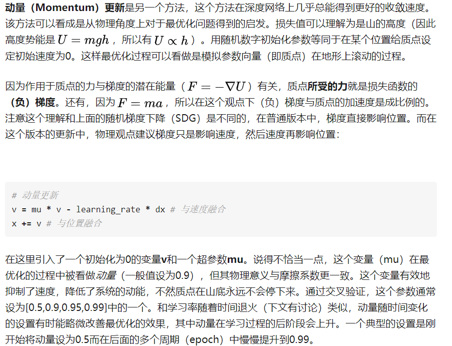
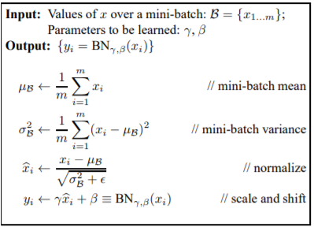
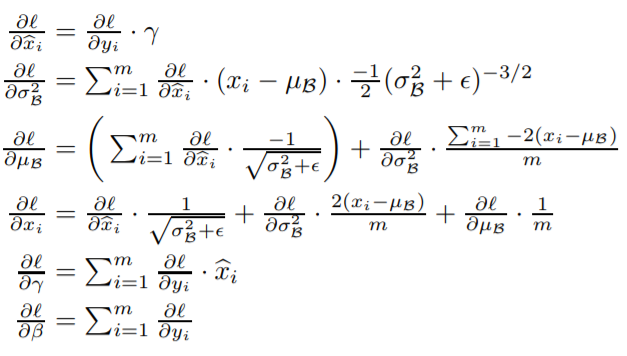
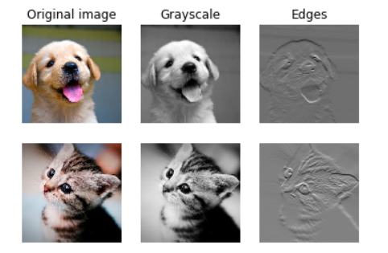
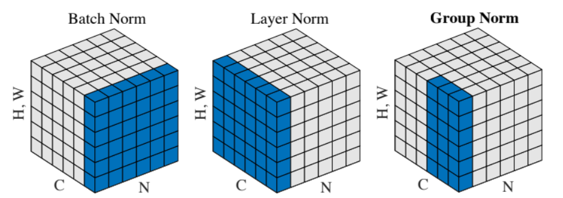
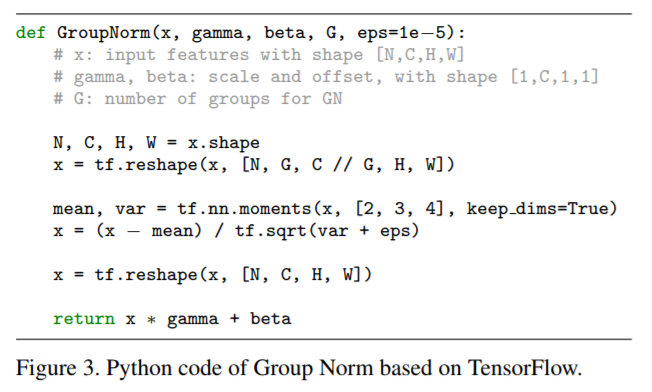

# Assignment 2

[TOC]

## FC

- 整个过程高度模块化，包括后面的**solver类**

  - **solver类**,具体可查看`solver.py`

    - `def init(self, model, data, **kwargs):`用来初始化参数，传递各种超参数

      - ```python
        # 从kwargs获得参数，或赋默认值的方法：
        self.update_rule = kwargs.pop('update_rule', 'sgd')
        self.optim_config = kwargs.pop('optim_config', {})
        self.lr_decay = kwargs.pop('lr_decay', 1.0)
        self.batch_size = kwargs.pop('batch_size', 100)
        self.num_epochs = kwargs.pop('num_epochs', 10)
        # ......
        ```

    - `def _reset(self):`将训练过程中一些记录量初始化，要单独初始化，防止不小心覆盖掉原数据

    - `def _step(self):`一次梯度下降，是被`train()`函数调用的

    - `def _save_checkpoint(self):`保存训练过程或结果，在开始时或结束时或epoch结束时调用

      - 使用**pickle库**保存

        - ```python
          with open('...','wb') as f:
          	pickle.dump(object, f)
          ```

        - ```
          with open('...','rb') as f:
          	object = pickle.load(f)
          ```

    - `def check_accuracy(self, X, y, num_samples=None, batch_size=100):`在给定数据上查看准确率

    - `def train(self):`训练模型

- 使用**字典**结构来记录一些训练过程量非常方便，不一定非要使用*数组list*

- **倒序遍历：**

    ```python
    for i in range(6)[::-1]:
        print(i)
        
    '''
    5
    4
    3
    2
    1
    0
    等同于reversed(range(6))以及range(5, -1, -1)
    https://www.cnblogs.com/mxh1099/p/5804064.html
    '''
    ```

- **几种optim方法：**

  - **动量更新**
    **这种方法的一个基本思想是：通过动量更新，参数向量会在任何有持续梯度的方向上增加速度。在原有梯度上跟了一个小尾巴。**
  - **RMSProp(root mean square prop)**这是一种对Adagrad方法的改进版
  - **Adam**看起来像是RMSProp的动量版
    - ***待解决***`Please implement the *complete* Adam update rule (with the bias correction mechanism), not the first simplified version mentioned in the course notes.)`

  - [**更多更基础的optim方法**](https://zhuanlan.zhihu.com/p/21798784?refer=intelligentunit)

- **plt作图排版：**

    ```python
    plt.subplot(3, 1, 1)
    plt.title('Training loss') # 第一个图的标题
    plt.xlabel('Iteration')
    
    plt.subplot(3, 1, 2)
    plt.title('Training accuracy') # 标题
    plt.xlabel('Epoch')
    
    plt.subplot(3, 1, 3)
    plt.title('Validation accuracy') # 标题
    plt.xlabel('Epoch')
    
    for update_rule, solver in list(solvers.items()): # update_rule有两个
      plt.subplot(3, 1, 1) # 第一个图
      plt.plot(solver.loss_history, 'o', label=update_rule)
      
      plt.subplot(3, 1, 2) # 第二个图
      plt.plot(solver.train_acc_history, '-o', label=update_rule)
    
      plt.subplot(3, 1, 3) # 第三个图
      plt.plot(solver.val_acc_history, '-o', label=update_rule)
    
    for i in [1, 2, 3]:
      plt.subplot(3, 1, i)
      plt.legend(loc='upper center', ncol=4) # 绘制图例，即表明什么颜色是什么label，设置为4列展示
    ```

    

## Batch Normalization

- **批量归一化可以理解为在网络的每一层之前都做预处理，只是这种操作以另一种方式与网络集成在了一起。 **

- 实现过程中，由于bn的论文中建议在test阶段使用一个更大规模的sample_mean值而不是用训练过程中的mean值，所以我们在训练中使用running_mean在每一步更新，将running_mean用于test阶段

  ```python
  running_mean = momentum * running_mean + (1 - momentum) * sample_mean
  running_var = momentum * running_var + (1 - momentum) * sample_var
  ```

  

- 

- 

- 相关论文：https://arxiv.org/pdf/1502.03167.pdf


## Layer Normalization

- **bn需要从batch中采样得到mean和var，所以对batch_size非常敏感。较小的batch_size导致小样本，使得效果不好**
- **Instead of normalizing over the batch, we normalize over the features.**
- 相关论文：https://arxiv.org/pdf/1607.06450.pdf
- 其实没啥增加的东西，只是变换了个思路。原先以行为单位，现在以列为单位；行是一组一组的数据，列是一个一个的feature。**参考csdn，一个思路是将输入转置，运算过程和bn一样，再将输出转置即可。**


## Dropout

- **正则化：**正则化方法是在训练数据不够多时，或者over training时，常常会导致过拟合（overfitting）。这时向原始模型引入额外信息，以便防止过拟合和提高模型泛化性能的一类方法的统称。
- **随机失活（Dropout） **是一个简单又极其有效的正则化方法，与L1正则化，L2正则化和最大范式约束等方法互为补充。类似于$p*x + (1-p) * 0$，因此在最后的答案后面要**除以** $p$，保证输出的范围不受影响。

## CNN——Convolutional Networks

- win10下环境配置：https://blog.csdn.net/bingo_6/article/details/80468967

- naive的代码中，对pad的实现需要使用`np.pad`

- 输出数据体在空间上的尺寸可以通过输入数据体尺寸（W），卷积层中神经元的感受野尺寸（F），步长（S）和零填充的数量（P）的函数来计算。*（这里假设输入数组的空间形状是正方形，即高度和宽度相等）*<br>**输出数据体的空间尺寸为$(W-F +2P)/S+1​$**

  - 比如输入是7x7，滤波器是3x3，步长为1，填充为0，那么就能得到一个5x5的输出。如果步长为2，输出就是3x3。下面是例子：

- **CNN可以用于一些常规的处理图像策略**上，如灰度化*(GrayScale)*和边缘化*(Edges)*等等

  ```python
  # 关键代码：即权重的控制，可以实现对图像的不同处理
  # 其中，w的第一维是不同的权重(grayscale or edges)，第二维是通道
  # The first filter converts the image to grayscale.
  # Set up the red, green, and blue channels of the filter.
  w[0, 0, :, :] = [[0, 0, 0], 
                   [0, 0.3, 0], 
                   [0, 0, 0]]
  
  w[0, 1, :, :] = [[0, 0, 0], 
                   [0, 0.6, 0], 
                   [0, 0, 0]]
  
  w[0, 2, :, :] = [[0, 0, 0], 
                   [0, 0.1, 0], 
                   [0, 0, 0]]
  # edge仅在blue上进行
  # Second filter detects horizontal edges in the blue channel.
  w[1, 2, :, :] = [[1, 2, 1], 
                   [0, 0, 0], 
                   [-1, -2, -1]]
  ```

  ```python
  # 完整代码，方便以后学习查阅：
  # from scipy.misc import imread, imresize # warning!!!这个库现在不用了，用下面的两行代替
  from imageio import imread
  from skimage.transform import resize as imresize
  
  kitten, puppy = imread('kitten.jpg'), imread('puppy.jpg')
  # kitten is wide, and puppy is already square
  d = kitten.shape[1] - kitten.shape[0]
  kitten_cropped = kitten[:, d//2:-d//2, :]
  
  img_size = 200   # Make this smaller if it runs too slow
  x = np.zeros((2, 3, img_size, img_size))
  x[0, :, :, :] = imresize(puppy, (img_size, img_size)).transpose((2, 0, 1))
  x[1, :, :, :] = imresize(kitten_cropped, (img_size, img_size)).transpose((2, 0, 1))
  
  # Set up a convolutional weights holding 2 filters, each 3x3
  w = np.zeros((2, 3, 3, 3))
  
  # The first filter converts the image to grayscale.
  # Set up the red, green, and blue channels of the filter.
  w[0, 0, :, :] = [[0, 0, 0], [0, 0.3, 0], [0, 0, 0]]
  w[0, 1, :, :] = [[0, 0, 0], [0, 0.6, 0], [0, 0, 0]]
  w[0, 2, :, :] = [[0, 0, 0], [0, 0.1, 0], [0, 0, 0]]
  
  # Second filter detects horizontal edges in the blue channel.
  w[1, 2, :, :] = [[1, 2, 1], [0, 0, 0], [-1, -2, -1]]
  
  # Vector of biases. We don't need any bias for the grayscale
  # filter, but for the edge detection filter we want to add 128
  # to each output so that nothing is negative.
  b = np.array([0, 128])
  
  # Compute the result of convolving each input in x with each filter in w,
  # offsetting by b, and storing the results in out.
  out, _ = conv_forward_naive(x, w, b, {'stride': 1, 'pad': 1})
  
  def imshow_noax(img, normalize=True):
      """ Tiny helper to show images as uint8 and remove axis labels """
      if normalize:
          img_max, img_min = np.max(img), np.min(img)
          img = 255.0 * (img - img_min) / (img_max - img_min)
      plt.imshow(img.astype('uint8'))
      plt.gca().axis('off')
  
  # Show the original images and the results of the conv operation
  plt.subplot(2, 3, 1)
  imshow_noax(puppy, normalize=False)
  plt.title('Original image')
  plt.subplot(2, 3, 2)
  imshow_noax(out[0, 0])
  plt.title('Grayscale')
  plt.subplot(2, 3, 3)
  imshow_noax(out[0, 1])
  plt.title('Edges')
  plt.subplot(2, 3, 4)
  imshow_noax(kitten_cropped, normalize=False)
  plt.subplot(2, 3, 5)
  imshow_noax(out[1, 0])
  plt.subplot(2, 3, 6)
  imshow_noax(out[1, 1])
  plt.show()
  ```

  

  

  - 如同Assignment1中提到的，**第一层的W可视化可以看到一些模型学到的东西**，可以方便查看模型是否学到东西。

- **层的尺寸设置规律**

  - **以下全文摘自[知乎](https://zhuanlan.zhihu.com/p/22038289?refer=intelligentunit)**
  - 到现在为止，我们都没有提及卷积神经网络中每层的超参数的使用。现在先介绍设置结构尺寸的一般性规则，然后根据这些规则进行讨论
  - **输入层**（包含图像的）应该能被2整除很多次。常用数字包括32（比如CIFAR-10），64，96（比如STL-10）或224（比如ImageNet卷积神经网络），384和512。
  - **卷积层**应该使用小尺寸滤波器（比如3x3或最多5x5），使用步长。还有一点非常重要，就是对输入数据进行零填充，这样卷积层就不会改变输入数据在空间维度上的尺寸。比如，当，那就使用来保持输入尺寸。当，一般对于任意，当的时候能保持输入尺寸。如果必须使用更大的滤波器尺寸（比如7x7之类），通常只用在第一个面对原始图像的卷积层上。
  - **汇聚层**负责对输入数据的空间维度进行降采样。最常用的设置是用用2x2感受野（即）的最大值汇聚，步长为2（）。注意这一操作将会把输入数据中75%的激活数据丢弃（因为对宽度和高度都进行了2的降采样）。另一个不那么常用的设置是使用3x3的感受野，步长为2。最大值汇聚的感受野尺寸很少有超过3的，因为汇聚操作过于激烈，易造成数据信息丢失，这通常会导致算法性能变差。
  - *减少尺寸设置的问题*：上文中展示的两种设置是很好的，因为所有的卷积层都能保持其输入数据的空间尺寸，汇聚层只负责对数据体从空间维度进行降采样。如果使用的步长大于1并且不对卷积层的输入数据使用零填充，那么就必须非常仔细地监督输入数据体通过整个卷积神经网络结构的过程，确认所有的步长和滤波器都尺寸互相吻合，卷积神经网络的结构美妙对称地联系在一起。
  - *为什么在卷积层使用1的步长*？在实际应用中，更小的步长效果更好。上文也已经提过，步长为1可以让空间维度的降采样全部由汇聚层负责，卷积层只负责对输入数据体的深度进行变换。
  - *为何使用零填充*？使用零填充除了前面提到的可以让卷积层的输出数据保持和输入数据在空间维度的不变，还可以提高算法性能。如果卷积层值进行卷积而不进行零填充，那么数据体的尺寸就会略微减小，那么图像边缘的信息就会过快地损失掉。
  - *因为内存限制所做的妥协*：在某些案例（尤其是早期的卷积神经网络结构）中，基于前面的各种规则，内存的使用量迅速飙升。例如，使用64个尺寸为3x3的滤波器对224x224x3的图像进行卷积，零填充为1，得到的激活数据体尺寸是[224x224x64]。这个数量就是一千万的激活数据，或者就是72MB的内存（每张图就是这么多，激活函数和梯度都是）。因为GPU通常因为内存导致性能瓶颈，所以做出一些妥协是必须的。在实践中，人们倾向于在网络的第一个卷积层做出妥协。例如，可以妥协可能是在第一个卷积层使用步长为2，尺寸为7x7的滤波器（比如在ZFnet中）。在AlexNet中，滤波器的尺寸的11x11，步长为4。

- *`numpy`调整维度的小技巧*

  ```python
  print(a.shape)
  # (3,2)
  a = a[:,:,None,None]
  print(a.shape)
  # (3,2,1,1)
  # 等同于a.reshape(a.shape[0],a.shape[1],1,1)
  ```

### Group Normalization

- **CNN中的BN——Spatial Batch Normalization**
  - **传统的BN**接受$(N,D)$，输出$(N,D)$，整个BN的过程是基于在$N$上的归一化处理，即$N$为minibatch的大小。

  - **CNN中的BN**接受$(N,C,H,W)$，输出$(N, C,H,W)$，其中$N$给定了minibatch的大小

    > `(H, W)` dimensions give the spatial size of the feature map.

    - 基于一种假设：we expect the statistics of **each feature channel** to be **relatively consistent** both between different imagesand different locations within the same image.

      就是把channel提出来当作feature，或者说$(N,C,H,W)$改成$(N * H * W,C)$就是传统BN了

    - 这里用到了`np.transpose`来对多维进行转置

    - 但这里出现了一个问题：对于**FC**网络，**一个隐藏层中的所有单元**都倾向于对最后的结果有**相同的贡献**，因此在隐藏层前进行bn是一种有效的操作。但在**CNN**中，**边缘处的单元贡献比较少**，因此二者是有区别的，**上面的BN方法结果并不好**



- **论文： **https://arxiv.org/pdf/1803.08494.pdf
- 
- **Group Norm**反向传播仿照BN论文，注意把`np.sum()`里的`axis`和`keepdims`改写就行了。