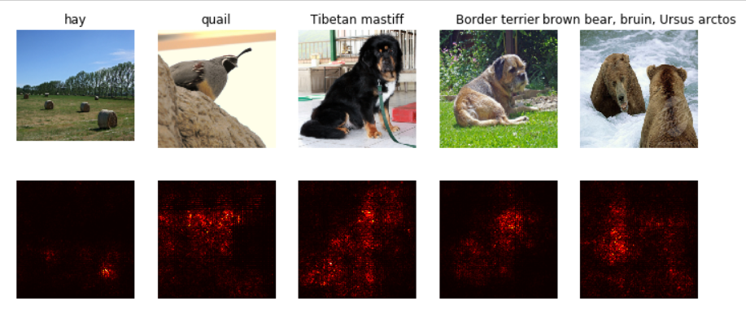
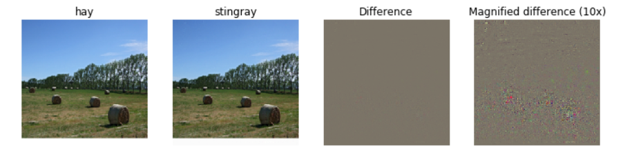
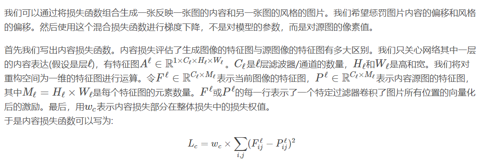

# Assignment 3

[TOC]

## RNN

- `os.remove()`的一个小坑：

  ```python
  def image_from_url(url):
      """
      Read an image from a URL. Returns a numpy array with the pixel data.
      We write the image to a temporary file then read it back. Kinda gross.
      """
      try:
          f = urllib.request.urlopen(url)
          _, fname = tempfile.mkstemp()
          with open(fname, 'wb') as ff:
              ff.write(f.read())
          img = imread(fname)
          
          # os.remove(fname)        
          # 这里只使用os.remove可能会由于文件占用而删除失败，进而导致程序中断而报错
          # 我选择采用多次删除，虽不甚解决，但可一定程度上缓解该问题，即下方注释中的代码
          '''
          count = 0
          while os.path.exists(fname):
          	count += 1
          	if count >= 200:
          		print("can't delete " + fname)
          		break
          	try:
          		os.remove(fname)
          	except:
          		pass
          '''
          
          return img
      except urllib.error.URLError as e:
          print('URL Error: ', e.reason, url)
      except urllib.error.HTTPError as e:
          print('HTTP Error: ', e.code, url)
  ```


- 预设的数据处理统一在`coco_utils.py`，以及两个`h5py`文件中，包含字典建立等等
- RNN反向传播：

  - 

- 在计算loss的时候，由于采用了对变长序列末尾进行填充**\<NULL\>**的操作，因此需要用一个mask罩住，过滤掉填充的部分（即以下代码中的*mask_flat*）

  ```python
  loss = -np.sum(mask_flat * np.log(probs[np.arange(N * T), y_flat])) / N
  ```

- RNN 在 test 与 train 不同，首先依旧是根据图片的 feature 映射出初始状态 h(0)，同样，h(0) 作为初始状态，类似于\<SOS\>即*StartOfSentence*，是不参与到计算 caption 的输出的。隐状态 h(1) 的输入是 x(0)，输出 caption 的第一个单词 x(1)，然后以 x(1) 作为第二个隐状态的输入，以此类推直至到序列允许的最大长度结束。

  **需要注意的是，这里序列允许的最大长度 max_length 和训练时一个 time capsule 的时序最大长度 T 没有任何关系**

- **这个初级任务还是蛮有意思的，涉及到很多nlp预处理的内容，很值得继续探索学习**

### word embedding

  - 参考<https://blog.csdn.net/fortilz/article/details/80935136>
  - 充分利用python的index用法，即`out = W[x, :]`和`np.add.at(dW,x,dout)`


## LSTM

- 

- 这里的技巧：
  - **Wx的大小为（D * 4H），可以用切片将其分为四份**
  - 在进行正向传播时，将每个过程所有的cache用字典保存下来
    - 虽然Wh、Wx等参数重复保存了，但由于反向传播需要的中间变量值太多（**i、f、o、g等**）为了方便起见直接用字典保存

## NetworkVisualization

- **图像预处理（以及反预处理）：**

  ```python
  # 这里有两个常量：SQUEEZENET_MEAN和SQUEEZENET_STD,是在数据样本上的平均值和标准差
  # 在这里分别为[0.485 0.456 0.406]、[0.229 0.224 0.225]
  from scipy.ndimage.filters import gaussian_filter1d
  def preprocess(img, size=224):
      transform = T.Compose([
          T.Resize(size),
          T.ToTensor(),
          T.Normalize(mean=SQUEEZENET_MEAN.tolist(),
                      std=SQUEEZENET_STD.tolist()),
          T.Lambda(lambda x: x[None]),
      ])
      return transform(img)
  
  def deprocess(img, should_rescale=True):
      transform = T.Compose([
          T.Lambda(lambda x: x[0]),
          T.Normalize(mean=[0, 0, 0], std=(1.0 / SQUEEZENET_STD).tolist()),
          T.Normalize(mean=(-SQUEEZENET_MEAN).tolist(), std=[1, 1, 1]),
          T.Lambda(rescale) if should_rescale else T.Lambda(lambda x: x),
          T.ToPILImage(),
      ])
      return transform(img)
  
  def rescale(x):
      low, high = x.min(), x.max()
      x_rescaled = (x - low) / (high - low)
      return x_rescaled
      
  def blur_image(X, sigma=1):
      X_np = X.cpu().clone().numpy()
      X_np = gaussian_filter1d(X_np, sigma, axis=2)
      X_np = gaussian_filter1d(X_np, sigma, axis=3)
      X.copy_(torch.Tensor(X_np).type_as(X))
      return X
  ```

- **pytorch调用预训练模型，一定记着关注是否要将*层锁住***

  ```python
  # Download and load the pretrained SqueezeNet model.
  model = torchvision.models.squeezenet1_1(pretrained=True)
  
  # We don't want to train the model, so tell PyTorch not to compute gradients
  # with respect to model parameters.
  for param in model.parameters():
      param.requires_grad = False
      
  # you may see warning regarding initialization deprecated, that's fine, please continue to next steps
  ```

- **关注data_utils.py**文件，里面有一些pipline感觉很好用，对数据的预处理方法
- `torch.gather()`

  > 用来获得一个矩阵对应index处的值：select one element from each row of a matrix

  > if `s` is an numpy array of shape `(N, C)` and `y` is a numpy array of shape `(N,`) containing integers `0 <= y[i] < C`, then `s[np.arange(N), y]` is a numpy array of shape `(N,)` which selects one element from each element in `s`using the indices in `y`.
  >
  >In PyTorch you can perform the same operation using the `gather()` method. If `s` is a PyTorch Tensor of shape `(N, C)` and `y` is a PyTorch Tensor of shape `(N,)` containing longs in the range `0 <= y[i] < C`, then
  >
  >```
  >s.gather(1, y.view(-1, 1)).squeeze()
  >```
  >
  >will be a PyTorch Tensor of shape `(N,)` containing one entry from each row of `s`, selected according to the indices in `y`.

  ```python
  # Example : pytorch & numpy
  def gather_example():
      print("pytorch:----------")
      N, C = 4, 5
      s = torch.randn(N, C)
      y = torch.LongTensor([1, 2, 1, 3])
      print(s)
      print(y)
      print(s.gather(1, y.view(-1, 1)).squeeze())
      print("numpy:------------")
      s_np = s.numpy()
      y_np = y.numpy()
      print(s_np)
      print(y_np)
      print(s_np[np.arange(s_np.shape[0]),y_np])
  gather_example()
  '''
  输出：
  pytorch:----------
  tensor([[ 1.7627, -0.6607, -0.3520, -0.2571, -0.8769],
          [ 0.2334,  0.4594,  1.0192,  0.9275,  0.9034],
          [-0.8965,  0.0752,  0.3113,  1.0231,  0.9140],
          [ 0.6513, -0.7271, -0.2857,  1.4312, -0.2872]])
  tensor([1, 2, 1, 3])
  tensor([-0.6607,  1.0192,  0.0752,  1.4312])
  numpy:------------
  [[ 1.7626708  -0.66067076 -0.3519853  -0.257107   -0.8769448 ]
   [ 0.23339012  0.4594468   1.0191643   0.927509    0.9033675 ]
   [-0.89649373  0.07521852  0.31125733  1.0231413   0.91399544]
   [ 0.6513413  -0.7271196  -0.2856611   1.4312186  -0.28721216]]
  [1 2 1 3]
  [-0.66067076  1.0191643   0.07521852  1.4312186 ]
  '''
  ```

  

### Saliency Maps

>A **saliency map** tells us the degree to which each pixel in the image affects the classification score for that image. 
>
>给定一个图像和 CNN 的分类结果，图像中哪个像素对分类结果贡献大？

- 参考论文：<https://arxiv.org/abs/1312.6034?context=cs>

- 参考博客：<http://davidlau.me/2018/01/12/cnn-saliency-maps/>

- 原文解释：

  >A **saliency map** tells us the degree to which each pixel in the image affects the classification score for that image. To compute it, we compute the gradient of the unnormalized score corresponding to the correct class (which is a scalar) with respect to the pixels of the image. If the image has shape `(3, H, W)` then this gradient will also have shape `(3, H, W)`; for each pixel in the image, this gradient tells us the amount by which the classification score will change if the pixel changes by a small amount. To compute the saliency map, we take the absolute value of this gradient, then take the maximum value over the 3 input channels; the final saliency map thus has shape `(H, W)` and all entries are nonnegative.
  >
  >*理解：*
  >
  >找一个图像的梯度，这个梯度具体指的是：分类的分数发生变化时，体现在具体图像具体像素的梯度，最终求出的是一个三个通道上的最大的绝对值，是一个单通道的、非负的、和原图大小相同的矩阵

- 

  

- 


- *pytorch实现*

  ```python
  # 按照提示，其所谓的loss即为正确分类对应的分数和（在一个batch上求和）
  
  scores = model(X)
  # 提取对应着正确分类的分数
  scores = scores.gather(1,y.view(-1,1)).squeeze()
  # 反向传播，即batch求和，直接作为loss反向传播
  loss = scores.sum()
  loss.backward()
  # 得到saliency_map，即绝对值+通道最大值
  saliency = X.grad.data
  saliency = saliency.abs()
  saliency,max_index = torch.max(saliency,dim = 1)
  saliency = saliency.squeeze() # 去除1维
  
  # 接下来画图的时候用热力图即可
  plt.imshow(saliency[i], cmap=plt.cm.hot)
  ```

  *有一个小坑：torch.max返回的是个tuple,为**max值和max_index值***




### Fooling Images

> We can also use image gradients to generate "fooling images" as discussed in [3]. Given an image and a target class, we can perform gradient **ascent** over the image to maximize the target class, stopping when the network classifies the image as the target class. Implement the following function to generate fooling images.
>
> 其实就是用上面的方法，updata the image，从而改变某些像素，降低正确分类上的分值，实现愚弄的效果，产生一张新的图片，使得网络对其分类变为target_y

- 参考论文：<https://arxiv.org/abs/1312.6199>

- *pytorch实现：*

  ```python
      ##############################################################################
      # TODO: Generate a fooling image X_fooling that the model will classify as   #
      # the class target_y. You should perform gradient ascent on the score of the #
      # target class, stopping when the model is fooled.                           #
      # When computing an update step, first normalize the gradient:               #
      #   dX = learning_rate * g / ||g||_2                                         #
      #                                                                            #
      # You should write a training loop.                                          #
      #                                                                            #
      # HINT: For most examples, you should be able to generate a fooling image    #
      # in fewer than 100 iterations of gradient ascent.                           #
      # You can print your progress over iterations to check your algorithm.       #
      ##############################################################################
      pass
      INTER_NUM = 100 # 迭代最多100次
      for iter in range(INTER_NUM):
          scores = model(X_fooling)
          # 得到分数，查看当前的分类
  #         print(scores.shape)
          pred_y = scores.data.argmax(dim = 1)
          if pred_y == target_y:
              break
          
          # 得到target_y上的分数
  #         scores = scores.gather(1,target_y.view(-1,1)).squeeze()
          # 原来只处理一张图片呀...
          scores = scores[0,target_y]
          loss = scores.sum()
          # 反向传播
          loss.backward()
          
          # 手动更新参数
          dX_fooling = X_fooling.grad.data
          X_fooling.data += learning_rate * (dX_fooling) / dX_fooling.norm()
          # 导数清零
          X_fooling.grad.data.zero_()
  ```

  

### Class visualization

> 方法同上，但是这次是从一个白噪声 image 开始，通过 gradient ascent 不断向想要得到的分类类别逼近。这里还加了一个 L2 reg 项。


- *pytorch实现*

  ```python
          ########################################################################
          # TODO: Use the model to compute the gradient of the score for the     #
          # class target_y with respect to the pixels of the image, and make a   #
          # gradient step on the image using the learning rate. Don't forget the #
          # L2 regularization term!                                              #
          # Be very careful about the signs of elements in your code.            #
          ########################################################################
          pass
          scores = model(img)
          
          scores = scores[0,target_y]
          loss = scores.sum()
          
          loss.backward()
          
          dimg = img.grad.data
          # 因为下面的参数更新是加法，因此L2需要通过减法附加在dimg上
          dimg -= 2 * l2_reg * img.data
          
          img.data += learning_rate * (dimg) / dimg.norm()
          
          img.grad.data.zero_()
          
          ########################################################################
          #                             END OF YOUR CODE                         #
          ########################################################################
  ```


## StyleTransfer

- 论文基础：<https://www.cv-foundation.org/openaccess/content_cvpr_2016/papers/Gatys_Image_Style_Transfer_CVPR_2016_paper.pdf>

- 博客：<https://blog.csdn.net/qq_25217875/article/details/82634487>

  > We will do this by first formulating a loss function that matches the content and style of each respective image in the feature space of a deep network, and then performing gradient descent on the pixels of the image itself.
  >
  > 通过一个已经训练好的模型（这里采用的是ImageNet上训练好的模型[SqueezeNet](<https://arxiv.org/abs/1602.07360>)），在模型的feature层（应该是中间层）对style和content的loss进行反向传播，使得其生成新的像素点

- 原文的一个小bug：在`extract_features`函数里，未对**x**的**device**进行讨论，可以加上`x.type(dtype)`进行转换

- 损失函数的构成：

  **内容损失*content loss* + 风格损失*style loss* + 整体多样性正则化*Total-variation regularization***

  - **内容损失*Content loss***

    - 

  - **风格损失*Style loss***

    - 

  - **整体多样性正则化*Total-variation regularization***

    - 

    - *这个的实现很考验思路和技术......*可以把矩阵平移一下，再作差，但要注意平移后要少一个元素

      ```python
          shape = img.size()
          row_cur = img[:, :, :-1, :]
          row_lat = img[:, :, 1:, :]
          col_cur = img[:, :, :, :-1]
          col_lat = img[:, :, :, 1:]
          row_result = row_lat - row_cur
          col_result = col_lat - col_cur
          row_result = row_result * row_result
          col_result = col_result * col_result    
          result = tv_weight * (torch.sum(row_result) + torch.sum(col_result))
          return result
      ```

- **最终实现：**

  直接求和，进行反向传播，注意将img的grad打开，以便于更新img产生新图

-  **特征反演 Feature Inversion**：这里如果将 **特征权值style_weight设置为0**，即相当于从一个噪声图片生成原图

## Generative Adversarial Networks (GANs)

- 论文基础：<https://arxiv.org/abs/1406.2661>、<https://arxiv.org/abs/1701.00160>

- 判别模型(Discriminative Model)：可以理解为做分类打标签的模型，包括image caption（可以看作是在句子空间中的标签）
- 生成模型(Generative Model)：<https://www.cnblogs.com/lifegoesonitself/p/3437747.html>

>We will train the **discriminator** to take images, and classify them as being real (belonging to the training set) or fake (not present in the training set). 
>
>Our other network, called the **generator**, will take random noise as input and transform it using a neural network to produce images. The goal of the generator is to fool the discriminator into thinking the images it produced are real.
>
>即：
>
>- 生成网络：从随机噪声中生成逼真图片试图愚弄判别网络
>- 判别网络：试图区分真实图片和生成的假图片

- 目标函数：


- 常规做法：

  1. update the **generator** ($G$) to minimize the probability of the __discriminator making the correct choice__. 
  2. update the **discriminator** ($D$) to maximize the probability of the __discriminator making the correct choice__.

  - 一个小小的改进：maximize the probability of the **discriminator making the incorrect choice**

  - 本文的做法：

    - In this assignment, we will alternate the following updates:

    1. Update the generator ($G$) to maximize the probability of the discriminator making the incorrect choice on generated data:
         $$\underset{G}{\text{maximize}}\;  \mathbb{E}_{z \sim p(z)}\left[\log D(G(z))\right]$$
    2. Update the discriminator ($D$), to maximize the probability of the discriminator making the correct choice on real and generated data:
         $$\underset{D}{\text{maximize}}\; \mathbb{E}_{x \sim p_\text{data}}\left[\log D(x)\right] + \mathbb{E}_{z \sim p(z)}\left[\log \left(1-D(G(z))\right)\right]​$$

- **pytorch*核心代码***

  

  ```python
  # bce_loss: the binary cross entropy loss
  def discriminator_loss(logits_real, logits_fake):
      """
      Computes the discriminator loss described above.
      
      Inputs:
      - logits_real: PyTorch Tensor of shape (N,) giving scores for the real data.
      - logits_fake: PyTorch Tensor of shape (N,) giving scores for the fake data.
      
      Returns:
      - loss: PyTorch Tensor containing (scalar) the loss for the discriminator.
      """
      loss = None
      
      true_labels = torch.ones_like(logits_real).type(dtype)
      real_image_loss = bce_loss(logits_real, true_labels)
      fake_image_loss = bce_loss(logits_fake, 1 - true_labels)
      loss = real_image_loss + fake_image_loss
      
      return loss
  
  def generator_loss(logits_fake):
      """
      Computes the generator loss described above.
  
      Inputs:
      - logits_fake: PyTorch Tensor of shape (N,) giving scores for the fake data.
      
      Returns:
      - loss: PyTorch Tensor containing the (scalar) loss for the generator.
      """
      loss = None
      
      true_labels = torch.ones_like(logits_fake).type(dtype)
      loss = bce_loss(logits_fake, true_labels)
      
      return loss
  ```

  ***训练代码***

  ```python
  def run_a_gan(D, G, D_solver, G_solver, discriminator_loss, generator_loss, show_every=250,batch_size=128, noise_size=96, num_epochs=10):
      """
      Train a GAN!
      
      Inputs:
      - D, G: PyTorch models for the discriminator and generator
      - D_solver, G_solver: torch.optim Optimizers to use for training the
        discriminator and generator.
      - discriminator_loss, generator_loss: Functions to use for computing the generator and discriminator loss, respectively.
      - show_every: Show samples after every show_every iterations.
      - batch_size: Batch size to use for training.
      - noise_size: Dimension of the noise to use as input to the generator.
      - num_epochs: Number of epochs over the training dataset to use for training.
      """
      iter_count = 0
      for epoch in range(num_epochs):
          for x, _ in loader_train: # loader_train是mnist数据集的加载
              if len(x) != batch_size: # 只取完整一个的batch
                  continue
              D_solver.zero_grad()
              real_data = x.type(dtype) # x全是训练集里面的样本，因此都是real的
              logits_real = D(2* (real_data - 0.5)).type(dtype) # 送入discriminator模型
  
              g_fake_seed = sample_noise(batch_size, noise_size).type(dtype) # 从noise开始生成fake样本
              fake_images = G(g_fake_seed).detach() # 送入generator模型
              logits_fake = D(fake_images.view(batch_size, 1, 28, 28)) # 得到fake的输出
  
              d_total_error = discriminator_loss(logits_real, logits_fake) # 努力把fake检查出来
              d_total_error.backward()
              D_solver.step()
  
              G_solver.zero_grad()
              g_fake_seed = sample_noise(batch_size, noise_size).type(dtype)
              fake_images = G(g_fake_seed)
  
              gen_logits_fake = D(fake_images.view(batch_size, 1, 28, 28))
              g_error = generator_loss(gen_logits_fake) # 努力隐瞒fake成为real
              g_error.backward()
              G_solver.step()
  
              if (iter_count % show_every == 0):
                  print('Iter: {}, D: {:.4}, G:{:.4}'.format(iter_count,d_total_error.item(),g_error.item()))
                  imgs_numpy = fake_images.data.cpu().numpy()
                  show_images(imgs_numpy[0:16])
                  plt.show()
                  print()
              iter_count += 1
  ```


### Least Squares GAN

- GAN另一种稳定的实现形式：<https://arxiv.org/abs/1611.04076>

- *唯一改动的部分即为***loss函数**

  

```python
def ls_discriminator_loss(scores_real, scores_fake):
    """
    Compute the Least-Squares GAN loss for the discriminator.
    
    Inputs:
    - scores_real: PyTorch Tensor of shape (N,) giving scores for the real data.
    - scores_fake: PyTorch Tensor of shape (N,) giving scores for the fake data.
    
    Outputs:
    - loss: A PyTorch Tensor containing the loss.
    """
    loss = None
    
    true_labels = torch.ones_like(scores_real).type(dtype)
    loss = 0.5 * (torch.mean((scores_real - true_labels)**2) + torch.mean(scores_fake **2))
    
    return loss

def ls_generator_loss(scores_fake):
    """
    Computes the Least-Squares GAN loss for the generator.
    
    Inputs:
    - scores_fake: PyTorch Tensor of shape (N,) giving scores for the fake data.
    
    Outputs:
    - loss: A PyTorch Tensor containing the loss.
    """
    loss = None
    true_labels = torch.ones_like(scores_fake)
    
    loss = 0.5 * torch.mean((scores_fake - true_labels)**2)
    return loss
```

### Deeply Convolutional GANs（DCGAN）

- 由于前面的网络结构太简单，没有*CNN*层，无法学到一些类似“边界”的信息，接下来会用*CNN*作为一个类似于特征提取器的网络

- 论文基础：<https://arxiv.org/abs/1511.06434>

- 关于`nn.ConvTranspose2d()`:<https://blog.csdn.net/FortiLZ/article/details/81051942>

  - ConvTranspose2d 实现的是 Conv2d 的逆过程，也就是将一张 m×m m \times mm×m 的图片，upsampling 到 n×n n \times nn×n，这里 n>m n &gt; mn>m。 ConvTranspose2d 的实现方法，与 Assignment 2 | ConvolutionalNetworks 计算 dx 的方法完全相同。实际上，不论在 PyTorch 还是在 TensorFlow 里面，ConvTranspose2d 的实现和计算 dx 的梯度的实现，使用的是同一段代码。在 PyTorch 的文档里明确说明了这一点：

  > This module can be seen as the gradient of Conv2d with respect to its input.

```shell

# Discriminator:
Sequential(
  (0): Conv2d(1, 32, kernel_size=(5, 5), stride=(1, 1))
  (1): LeakyReLU(negative_slope=0.01)
  (2): MaxPool2d(kernel_size=2, stride=2, padding=0, dilation=1, ceil_mode=False)
  (3): Conv2d(32, 64, kernel_size=(5, 5), stride=(1, 1))
  (4): LeakyReLU(negative_slope=0.01)
  (5): MaxPool2d(kernel_size=2, stride=2, padding=0, dilation=1, ceil_mode=False)
  (6): Flatten()
  (7): Linear(in_features=1024, out_features=1024, bias=True)
  (8): LeakyReLU(negative_slope=0.01)
  (9): Linear(in_features=1024, out_features=1, bias=True)
)

# Generator:
Sequential(
  (0): Linear(in_features=96, out_features=1024, bias=True)
  (1): ReLU()
  (2): BatchNorm1d(1024, eps=1e-05, momentum=0.1, affine=True, track_running_stats=True)
  (3): Linear(in_features=1024, out_features=6272, bias=True)
  (4): ReLU()
  (5): BatchNorm1d(6272, eps=1e-05, momentum=0.1, affine=True, track_running_stats=True)
  (6): Unflatten()
  (7): ConvTranspose2d(128, 64, kernel_size=(4, 4), stride=(2, 2), padding=(1, 1))
  (8): ReLU()
  (9): BatchNorm2d(64, eps=1e-05, momentum=0.1, affine=True, track_running_stats=True)
  (10): ConvTranspose2d(64, 1, kernel_size=(4, 4), stride=(2, 2), padding=(1, 1))
  (11): Tanh()
  (12): Flatten()
)
```